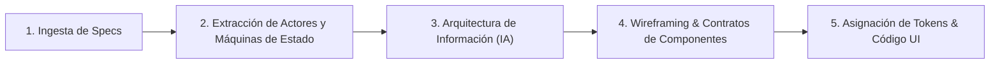

# Spec-to-Design: De Especificación Técnica a Interfaz de Usuario

Esta skill establece un pipeline riguroso para transformar especificaciones técnicas, documentos de requisitos de producto (PRD), modelos entidad-relación y flujos de negocio en interfaces de usuario funcionales, consistentes y listas para implementación.

---

## 1. El Pipeline de 5 Pasos: Requisitos → Interfaz



---

## 2. Paso 1: Ingesta y Matriz de Actores

Al recibir especificaciones técnicas o documentación del sistema, identificar y desglosar:

1. **Actores del Sistema y Entorno Físico**:
   - **Operador de Garita**: Monitor único o dual, teclado industrial o estándar, escáner LPR, ambiente ruidoso, tiempo de atención <15 segundos por vehículo.
   - **Cajero / Tesorería**: Gaveta de dinero, impresora térmica de boletas, terminal de pago con tarjetas, flujo de arqueo y conciliación.
   - **Supervisor / Jefe de Operaciones**: Vista global multicinto, anulación de tickets con motivo, autorización de aperturas de barrera forzadas.
   - **Administrador ERP / Contador**: Exportaciones contables, reportes de recaudación por turnos/cajeros, gestión de contratos de abonados y emisión de facturas.
   - **Usuario / Conductor**: Pantalla de tótem exterior o cajero automático de autoservicio (interfaz táctil simplificada, alto contraste solar, pocos pasos).

2. **Requisitos No Funcionales de UI**:
   - Tiempos de refresco en vivo (WebSockets / SSE para sensores y barreras).
   - Tolerancia a desconexión local (modo offline/contingencia).
   - Accesibilidad visual y soporte para turnos 24/7 (modos día y noche).

---

## 3. Paso 2: Mapeo de Máquinas de Estado de Negocio

Antes de dibujar cualquier pantalla, documentar formalmente las transiciones de estado de las entidades principales:

### Ciclo de Vida del Ticket de Estacionamiento
```
[Entrada: Detección LPR / Botón Tótem]
       │
       ▼
 [EMITIDO] ───────────► [ESTACIONADO (Calculando tiempo)]
                              │
                              ▼
                        [EN COBRO (Caja / Tótem)]
                              │
               ┌──────────────┴──────────────┐
               ▼                             ▼
       [PAGADO (Tiempo gracia 15m)]   [CONVENIO / DESCUENTO APLICADO]
               │                             │
               ▼                             ▼
    [SALIDA VALIDADA (LPR / Barrera)] ◄──────┘
               │
               ▼
           [CERRADO]
 (Excepciones: [EXTRAVIADO], [ANULADO SUPERVISOR], [SOBRESTADÍA])
```

---

## 4. Paso 3: Arquitectura de Información y Mapa de Navegación

Estructurar la aplicación respetando el principio de menor esfuerzo cognitivo:

1. **Nivel 1 - Operación en Tiempo Real**:
   - Garita Entrada / Salida (Cockpit prioritario).
   - Monitor de Ocupación (Plano de plantas y zonas).
2. **Nivel 2 - Gestión y Caja Diaria**:
   - Punto de Venta / Caja manual (Cobro, reimpresión, arqueo de turno).
   - Búsqueda y Validación de Tickets (Filtro por matrícula parcial o fecha).
3. **Nivel 3 - Módulos ERP y Administración**:
   - Tarifas y Calendarios (Tarifas dinámicas, horarios festivos).
   - Abonados y Convenios (Contratos mensuales, flotas empresariales, sellos comerciales).
   - Facturación e Informes Fiscales (Comprobantes Z, libro de ventas, exportación contable).
4. **Nivel 4 - Infraestructura y Hardware**:
   - Telemetría de Barreras, Sensores ultrasónicos/cámaras, Tótems e Impresoras.

---

## 5. Paso 4: Blueprint y Wireframing Estructurado

Generar la maqueta en texto/ASCII y describir los contratos de props de cada componente antes de escribir el código final:

### Plantilla de Especificación de Pantalla
```markdown
### Nombre de Pantalla: [Ej: ModuloCobroGarita.tsx]
- **Objetivo Primario**: Cobrar ticket en menos de 10 segundos registrando método de pago.
- **Entidades Vinculadas**: Ticket, TarifaVigente, DescuentoComercio, TurnoCajero.
- **Acciones Críticas**:
  1. Ingreso de ID Ticket o Patente (Autofocus).
  2. Selección de Pago (Efectivo / POS / Convenio).
  3. Disparo de apertura de barrera e impresión de comprobante.
- **Atajos de Teclado**: [F5: Cobrar], [F6: Efectivo], [F7: POS], [Esc: Limpiar].
- **Manejo de Errores**:
  - Matrícula no encontrada -> Modal rápido para ticket extraviado con cálculo por hora estimada.
  - Timeout POS -> Reintento inmediato sin duplicar cargo.
```

---

## 6. Paso 5: Conexión con el Sistema de Diseño y Código

1. Traducir cada bloque del wireframe a componentes atómicos (`Button`, `Badge`, `DataTable`, `Dialog`, `StatCard`).
2. Asignar tokens semánticos (superficies, bordes, estados de plaza) usando los valores definidos en `pms-erp-dashboard-design` y `ui-ux-pro-max`.
3. Validar con `web-design-guidelines` antes de dar por completado el componente.
