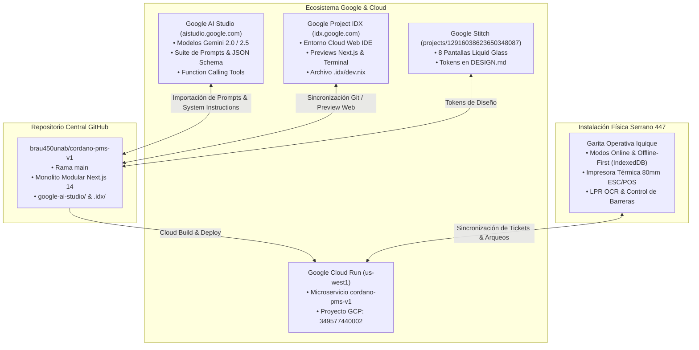

# 🌟 Guía Oficial de Integración: ParkOps Cordano en Google AI Studio & Project IDX

Esta guía explica detalladamente cómo conectar, importar y ejecutar el proyecto **ParkOps PMS & ERP** (*Cordano Inversiones Inmobiliarias Ltda.* — Serrano 447, Iquique) en **Google AI Studio** (`aistudio.google.com`) y **Google Project IDX** (`idx.google.com`), manteniendo la sincronización bidireccional con **GitHub** y **Google Cloud Run**.

---

## 📑 Tabla de Contenidos
1. [Arquitectura de Integración](#1-arquitectura-de-integración)
2. [Método 1: Apertura en 1-Click con Google Project IDX / AI Studio](#2-método-1-apertura-en-1-click-con-google-project-idx--ai-studio)
3. [Método 2: Importación de la Suite de Prompts en Google AI Studio](#3-método-2-importación-de-la-suite-de-prompts-en-google-ai-studio)
4. [Método 3: Configuración de Clave API de Gemini (`GEMINI_API_KEY`)](#4-método-3-configuración-de-clave-api-de-gemini-gemini_api_key)
5. [Método 4: Uso de Herramientas Operativas y Function Calling](#5-método-4-uso-de-herramientas-operativas-y-function-calling)
6. [Método 5: Despliegue Continuo a Google Cloud Run](#6-método-5-despliegue-continuo-a-google-cloud-run)

---

## 🏛️ 1. Arquitectura de Integración



---

## ⚡ 2. Método 1: Apertura en 1-Click con Google Project IDX / AI Studio

Google Project IDX es el entorno oficial en la nube de Google para desarrollo fullstack con Gemini y Google AI Studio. Gracias a la configuración contenida en [`.idx/dev.nix`](file:///c:/Users/BraulioAM/OneDrive%20-%20UNIVERSIDAD%20ANDRES%20BELLO/PROYECTOS%20ANTIGRAVITY/NUEVO%20PMS%20CORDANO/.idx/dev.nix), puedes importar el proyecto inmediatamente:

1. Ingresa a **[Google Project IDX](https://idx.google.com/)**.
2. Selecciona **"Import a repo"** (Importar un repositorio).
3. Pega la URL del repositorio:
   ```text
   https://github.com/brau450unab/cordano-pms-v1
   ```
4. Project IDX detectará automáticamente `.idx/dev.nix`, provisionará Node.js 20, instalará las dependencias y levantará el servidor Next.js en el puerto `3000` con vista previa interactiva en vivo.

---

## 🧠 3. Método 2: Importación de la Suite de Prompts en Google AI Studio

Dentro de la carpeta [`google-ai-studio/`](file:///c:/Users/BraulioAM/OneDrive%20-%20UNIVERSIDAD%20ANDRES%20BELLO/PROYECTOS%20ANTIGRAVITY/NUEVO%20PMS%20CORDANO/google-ai-studio/) se encuentran las plantillas oficiales listas para ser utilizadas en [Google AI Studio](https://aistudio.google.com/):

| Prompt / Módulo | Archivo JSON | Modelo Recomendado | Propósito Operativo |
| :--- | :--- | :--- | :--- |
| **Reconocimiento LPR / OCR** | [`google-ai-studio/prompts/lpr_plate_recognition_v2.json`](file:///c:/Users/BraulioAM/OneDrive%20-%20UNIVERSIDAD%20ANDRES%20BELLO/PROYECTOS%20ANTIGRAVITY/NUEVO%20PMS%20CORDANO/google-ai-studio/prompts/lpr_plate_recognition_v2.json) | `gemini-2.0-flash` | Lectura de matrículas chilenas en fotogramas de entrada/salida. |
| **Inspección de Daños** | [`google-ai-studio/prompts/damage_inspection_multimodal.json`](file:///c:/Users/BraulioAM/OneDrive%20-%20UNIVERSIDAD%20ANDRES%20BELLO/PROYECTOS%20ANTIGRAVITY/NUEVO%20PMS%20CORDANO/google-ai-studio/prompts/damage_inspection_multimodal.json) | `gemini-2.0-flash` | Detección pericial de abolladuras o rayones al ingresar. |
| **Auditoría de Arqueo Ciego** | [`google-ai-studio/prompts/cashier_shift_audit.json`](file:///c:/Users/BraulioAM/OneDrive%20-%20UNIVERSIDAD%20ANDRES%20BELLO/PROYECTOS%20ANTIGRAVITY/NUEVO%20PMS%20CORDANO/google-ai-studio/prompts/cashier_shift_audit.json) | `gemini-2.5-pro` | Detección antifraude, análisis de descuadres y justificación de descuentos. |
| **Copiloto de Garita (Tools)** | [`google-ai-studio/prompts/garita_copilot_assistant.json`](file:///c:/Users/BraulioAM/OneDrive%20-%20UNIVERSIDAD%20ANDRES%20BELLO/PROYECTOS%20ANTIGRAVITY/NUEVO%20PMS%20CORDANO/google-ai-studio/prompts/garita_copilot_assistant.json) | `gemini-2.0-flash` | Asistente de garita con llamadas a funciones (`lookupTicket`, `openBarrier`). |
| **Yield & Tarifas Dinámicas** | [`google-ai-studio/prompts/dynamic_pricing_advisor.json`](file:///c:/Users/BraulioAM/OneDrive%20-%20UNIVERSIDAD%20ANDRES%20BELLO/PROYECTOS%20ANTIGRAVITY/NUEVO%20PMS%20CORDANO/google-ai-studio/prompts/dynamic_pricing_advisor.json) | `gemini-2.5-flash` | Algoritmo de optimización tarifaria según ocupación de las 30 plazas. |

### Cómo cargar un Prompt en Google AI Studio:
1. Abre [Google AI Studio](https://aistudio.google.com/).
2. Haz clic en **"Create New Prompt"** > **"Structured Prompt"** o **"Chat Prompt"**.
3. Copia el contenido de `systemInstruction` desde [`system_instructions.md`](file:///c:/Users/BraulioAM/OneDrive%20-%20UNIVERSIDAD%20ANDRES%20BELLO/PROYECTOS%20ANTIGRAVITY/NUEVO%20PMS%20CORDANO/google-ai-studio/system_instructions.md) y pégalo en el panel de **System Instructions**.
4. En **Response Format**, activa `JSON` y carga el `responseSchema` provisto en los archivos JSON.

---

## 🔑 4. Configuración de Clave API de Gemini (`GEMINI_API_KEY`)

Para habilitar la IA en tiempo real en la aplicación Next.js y en el entorno local/cloud:

1. Obtén tu clave gratuita en [Google AI Studio Get API Key](https://aistudio.google.com/app/apikey).
2. Crea un archivo `.env.local` en la raíz del proyecto (o agrégalo en las variables de entorno de Cloud Run):
   ```env
   GEMINI_API_KEY="AIzaSy..."
   NEXT_PUBLIC_FACILITY_NAME="ParkOps Cordano - Serrano 447"
   ```
3. El SDK unificado [`src/lib/aiStudio.ts`](file:///c:/Users/BraulioAM/OneDrive%20-%20UNIVERSIDAD%20ANDRES%20BELLO/PROYECTOS%20ANTIGRAVITY/NUEVO%20PMS%20CORDANO/src/lib/aiStudio.ts) utilizará automáticamente el nuevo cliente `@google/genai`.

---

## 🛠️ 5. Uso de Herramientas Operativas y Function Calling

Google AI Studio permite que Gemini ejecute acciones en la garita mediante Function Calling. El esquema completo se encuentra en [`google-ai-studio/tools_schema.json`](file:///c:/Users/BraulioAM/OneDrive%20-%20UNIVERSIDAD%20ANDRES%20BELLO/PROYECTOS%20ANTIGRAVITY/NUEVO%20PMS%20CORDANO/google-ai-studio/tools_schema.json) y el endpoint ejecutor en [`src/app/api/ai/tools/route.ts`](file:///c:/Users/BraulioAM/OneDrive%20-%20UNIVERSIDAD%20ANDRES%20BELLO/PROYECTOS%20ANTIGRAVITY/NUEVO%20PMS%20CORDANO/src/app/api/ai/tools/route.ts):

- `lookupTicketByPlateOrId`: Búsqueda instantánea de estancias.
- `calculateParkingFee`: Cálculo con 10 min de gracia y tarifas por categoría (`Auto $25/min`, `Camioneta $30/min`, `Moto $15/min`).
- `openBarrierGate`: Apertura de barrera con registro de auditoría.
- `getOccupancyMatrix`: Mapa de 30 plazas (Sector A 01-15 / Sector B 16-30).
- `authorizeDiscountWithPin`: Validación antifraude de PIN individual y justificación.
- `registerNightOverstay`: Submódulo de pernocta ($8.000 CLP).
- `submitShiftAuditReport`: Arqueo ciego con detección de descuadres.

---

## 🚀 6. Despliegue Continuo a Google Cloud Run

Para desplegar la versión actualizada directamente a Cloud Run:
```bash
# Ejecutar script automatizado de Cloud Build y Cloud Run
.\deploy-cloudrun.bat
```
O mediante Google Cloud SDK:
```bash
gcloud run deploy cordano-pms-v1 \
  --project=gen-lang-client-0862587160 \
  --region=us-west1 \
  --source=. \
  --port=8080 \
  --allow-unauthenticated
```
- **URL de Producción Cloud Run**: `https://cordano-pms-v1-349577440002.us-west1.run.app`
