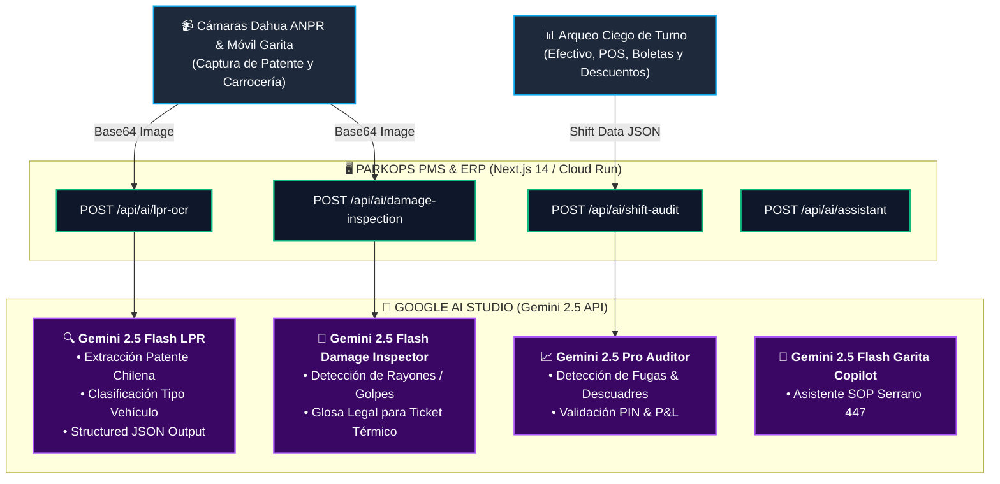

# Integración Oficial con Google AI Studio & Gemini API
## ParkOps PMS & ERP — Cordano Inversiones Inmobiliarias Ltda. (Serrano 447, Iquique)
**Versión**: 1.0 Canónica  
**Modelos Activos**: `gemini-2.5-flash` (Baja latencia Garita) | `gemini-2.5-pro` (Auditoría Gerencial P&L)  
**SDK**: `@google/genai` v0.1.2+  

---

## 1. Resumen Ejecutivo de la Integración

La integración con **Google AI Studio** dota al sistema ParkOps Cordano de capacidades de visión multimodal e inteligencia operativa en tiempo real, optimizadas específicamente para el recinto físico de **Serrano 447, Iquique** (~700 m², 30 plazas):



---

## 2. Configuración de Variables de Entorno

En el archivo `.env.local` (entorno de desarrollo) o en las variables de entorno de **Google Cloud Run** (`cordano-pms-v1`):

```bash
# Google AI Studio / Gemini API Key
GEMINI_API_KEY="AIzaSy..."
GOOGLE_AI_STUDIO_API_KEY="AIzaSy..."

# Cloud Run GCP Service
GCP_PROJECT_ID="gen-lang-client-0862587160"
GCP_PROJECT_NUMBER="349577440002"
CLOUD_RUN_REGION="us-west1"
```

---

## 3. Catálogo de Microservicios de IA Implementados

### A. Reconocimiento Óptico de Patentes (ANPR / LPR)
* **Endpoint**: `POST /api/ai/lpr-ocr`
* **Modelo**: `gemini-2.5-flash`
* **Esquema de Salida Estructurada (JSON Schema)**:
```json
{
  "plate": "KJ-89-21",
  "format": "NEW_CHILE",
  "confidence": 0.99,
  "vehicleTypeHint": "AUTO",
  "colorHint": "Gris Plata",
  "makeModelHint": "Toyota Yaris"
}
```

### B. Inspección Visual de Daños Preexistentes
* **Endpoint**: `POST /api/ai/damage-inspection`
* **Modelo**: `gemini-2.5-flash`
* **Propósito**: Generar automáticamente la glosa legal que se imprime en el ticket térmico de 80mm al ingresar, protegiendo al estacionamiento contra reclamos falsos de rayones o abolladuras previas.
* **Esquema de Salida Estructurada**:
```json
{
  "hasDamage": true,
  "damages": [
    {
      "location": "Parachoques delantero derecho",
      "type": "RAYON",
      "severity": "LEVE",
      "description": "Raspón superficial de pintura blanca cerca del neblinero."
    }
  ],
  "summaryText": "Constancia: Rayón leve en parachoques del. der."
}
```

### C. Auditoría Financiera de Turno y Arqueo Ciego
* **Endpoint**: `POST /api/ai/shift-audit`
* **Modelo**: `gemini-2.5-pro`
* **Propósito**: Analizar el Reporte Z de cada cajero, comparar el efectivo físico recontado contra el efectivo sistema, auditar los descuentos aplicados con PIN y sugerir acciones correctivas a la gerencia de Cordano.
* **Esquema de Salida Estructurada**:
```json
{
  "status": "OPTIMO",
  "discrepancyClp": 0,
  "confidenceScore": 0.98,
  "anomaliesDetected": [],
  "executiveSummary": "Turno de Juan Pérez auditado. Recaudación total $184.500 CLP sin descuadres.",
  "recommendations": [
    "Proceder con depósito bancario en caja fuerte de Serrano 447",
    "Archivar duplicado físico del Reporte Z"
  ]
}
```

### D. Copiloto de Asistencia Operativa de Garita
* **Endpoint**: `POST /api/ai/assistant`
* **Modelo**: `gemini-2.5-flash`
* **Propósito**: Asistir al operador en turno ante dudas de tarifas (Auto $25/min, Camioneta $30/min, Moto $15/min), protocolo de 10 minutos de gracia, contingencia offline (tickets sufijo `O`) y procedimientos de ticket perdido con PIN de administrador.

---

## 4. Pruebas y Validación de la Integración

Los endpoints cuentan con modo **Fail-Safe / Resiliente**: Si no se provee `GEMINI_API_KEY`, el sistema conmuta automáticamente a respuestas estándar simuladas de contingencia para no interrumpir el flujo del operador en garita ni detener la compilación de producción.
