# Mapa de Sitio y Arquitectura de Navegación — ParkOps PMS & ERP
## Cordano Inversiones Inmobiliarias Ltda. · Serrano 447, Iquique
**Versión**: 2.0 Canónica  
**Framework**: Next.js 14 App Router + Cloud Run Microservice  

---

## 1. Diagrama Jerárquico del Mapa de Sitio

```mermaid
flowchart TD
    classDef public fill:#1e293b,stroke:#0ea5e9,stroke-width:2px,color:#f8fafc;
    classDef auth fill:#334155,stroke:#f59e0b,stroke-width:2px,color:#f8fafc;
    classDef operator fill:#0f172a,stroke:#10b981,stroke-width:2px,color:#f8fafc;
    classDef admin fill:#0f172a,stroke:#8b5cf6,stroke-width:2px,color:#f8fafc;
    classDef api fill:#020617,stroke:#64748b,stroke-width:1px,color:#94a3b8;

    %% Nivel 0: Entrada Pública
    Landing["🌐 /landing<br/><b>Landing Page Pública</b><br/>• Vitrina Comercial<br/>• Galería Serrano 447<br/>• FAQ y Tarifas"]:::public

    %% Nivel 1: Autenticación y Acceso
    Login["🔐 /login<br/><b>Inicio de Sesión</b><br/>• Operador (PIN Rápido)<br/>• Administrador (Password)"]:::auth
    Recuperar["🔑 /recuperar-password<br/>Recuperación de Clave"]:::auth
    Registro["📝 /registro<br/>Alta de Personal"]:::auth

    Landing -->|Botón Iniciar Sesión| Login
    Landing -->|Tutoriales Protegidos| Login
    Login --> Recuperar
    Login --> Registro

    %% Nivel 2A: Portal Operativo de Garita (Rol: OPERADOR)
    subgraph Garita["📍 PORTAL OPERATIVO DE GARITA (Uso Diario sin Scroll)"]
        Home["🖥️ /<br/><b>Cockpit de Garita & POS</b>"]:::operator
        
        %% Modales Operativos Flotantes
        ModalOpen["Modal: Apertura de Turno<br/>(Fondo Inicial Sencillo)"]:::operator
        ModalCheckin["Modal: Verificación Check-in<br/>(Patente, Conductor, Daños)"]:::operator
        ModalCheckout["Modal: Cobro y Salida<br/>(Vuelto Gigante, POS/Efectivo)"]:::operator
        ModalSpecial["Modal: Servicios Especiales<br/>(Noche y Convenios)"]:::operator
        ModalClose["Modal: Arqueo Ciego<br/>(Billetes, Monedas y Reporte Z)"]:::operator
        
        Home --> ModalOpen
        Home --> ModalCheckin
        Home --> ModalCheckout
        Home --> ModalSpecial
        Home --> ModalClose
    end

    %% Nivel 2B: Portal Administrativo y Gerencial (Rol: ADMINISTRADOR)
    subgraph AdminPortal["🏢 PORTAL ADMINISTRATIVO & GERENCIAL"]
        AdminDashboard["📊 /admin<br/><b>Panel de Control Gerencial</b><br/>• Ocupación y Supervisión en Vivo<br/>• Trazabilidad de Cajas y Turnos<br/>• Gestión de Operadores y PINs"]:::admin
        Reportes["📈 /reportes<br/><b>Suite de Reportes Financieros</b><br/>• Consolidado Diario / Mensual P&L<br/>• Exportación Excel (XLSX) y PDF<br/>• Horas Punta y Tiempos de Estadía"]:::admin
        Configuracion["⚙️ /configuracion<br/><b>Motor de Tarifas y Parámetros</b><br/>• Precios por Minuto (Auto/Camioneta/Moto)<br/>• Minutos de Gracia y Multa Ticket Perdido<br/>• Contratos de Convenios y Planes Noche"]:::admin
        AuditView["🛡️ /admin/auditoria<br/><b>Audit Trail Inmutable</b><br/>• Descuentos con PIN de Operador<br/>• Anulaciones autorizadas por Admin<br/>• Historial de Descuadres de Caja"]:::admin
        CCTV["📹 /cctv<br/><b>Visualizador de Cámaras CCTV</b><br/>• Cámaras de Acceso y Garita"]:::admin
        Docs["📚 /documentacion<br/><b>Manuales Operativos y Guías</b><br/>• Protocolos de Contingencia"]:::admin
        FAQPage["❓ /faq<br/><b>Base de Conocimiento</b>"]:::admin
        
        AdminDashboard --> Reportes
        AdminDashboard --> Configuracion
        AdminDashboard --> AuditView
        AdminDashboard --> CCTV
        AdminDashboard --> Docs
        AdminDashboard --> FAQPage
    end

    %% Redirección post-login
    Login -->|Rol: OPERADOR| Home
    Login -->|Rol: ADMINISTRADOR| AdminDashboard

    %% Nivel 3: Capa de Microservicios y Endpoints API (Cloud Run)
    subgraph BackendAPI["⚡ MICROSERVICIOS Y APIS REST (Google Cloud Run)"]
        ApiCheckin["POST /api/checkin<br/>Ingreso y Ticket Dual"]:::api
        ApiCheckout["POST /api/checkout<br/>Salida, Vuelto y Cobro"]:::api
        ApiSlots["GET /api/slots<br/>Estado de 30 Plazas"]:::api
        ApiShifts["GET/POST /api/shifts<br/>Apertura y Arqueo Ciego"]:::api
        ApiSpecial["POST /api/special-services<br/>Noche y Convenios"]:::api
        ApiAudit["GET/POST /api/audit<br/>Registro Inmutable"]:::api
        ApiCloudRun["GET /api/cloudrun<br/>Telemetría y Sincronización"]:::api
        ApiHealth["GET /api/health<br/>Healthcheck Uptime"]:::api
    end

    Home -.->|Fetch / Sync| ApiCheckin
    Home -.->|Fetch / Sync| ApiCheckout
    Home -.->|Fetch / Sync| ApiSlots
    Home -.->|Fetch / Sync| ApiShifts
    Home -.->|Fetch / Sync| ApiSpecial
    AdminDashboard -.->|Query| ApiAudit
    AdminDashboard -.->|Query| ApiShifts
    AdminDashboard -.->|Query| ApiCloudRun
```

---

## 2. Desglose Estructurado de Vistas y Módulos

### MÓDULO 1: CAPA PÚBLICA E INFORMATIVA

| Ruta | Nombre de la Vista | Audiencia / Acceso | Propósito y Contenido Principal |
| :--- | :--- | :--- | :--- |
| **`/landing`** | **Landing Page Comercial & Acceso** | Público general y Personal | Vitrina del software, tarifas transparentes, galería fotográfica del recinto en Serrano 447, preguntas frecuentes (FAQ) y botón de acceso a login. |
| **`/login`** | **Portal de Inicio de Sesión** | Personal de la empresa | Pantalla dedicada con selector de rol: **Operador de Garita** (autenticación por PIN de 4 dígitos) o **Administrador** (credenciales corporativas). |
| **`/recuperar-password`** | **Recuperación de Acceso** | Usuarios registrados | Flujo de restablecimiento seguro de claves administrativas. |
| **`/registro`** | **Alta de Usuarios** | Solo invitación/Admin | Formulario para enrolamiento de nuevos cajeros u operadores. |
| **`/faq`** | **Centro de Ayuda / FAQ** | Público y Personal | Preguntas frecuentes sobre tiempo de gracia, medios de pago y políticas de tickets extraviados. |

---

### MÓDULO 2: PORTAL OPERATIVO DE GARITA (ROL: OPERADOR)

> [!IMPORTANT]
> **Diseño 1080p sin scroll**: Todo este portal está diseñado en una distribución **Bi-Panel Asimétrica (40% / 60%)** para que el cajero opere a máxima velocidad mediante teclado (`F1`–`F9`, `Enter`, `Esc`) sin necesidad de desplazarse verticalmente.

| Componente / Modal en `/` | Tipo de Interfaz | Función Operativa |
| :--- | :--- | :--- |
| **Menubar Superior Fija** | Barra fija superior | Traffic lights macOS, tabs de navegación, reloj oficial de Chile en vivo (`CLT`), indicador Cloud Run (`En Línea` / `Modo Offline O`), y botón de cierre de turno. |
| **Panel Izquierdo (40%)** | Formulario Check-in | Autofoco en Patente, selector de vehículo (Auto `$25`, Camioneta `$30`, Moto `$15`), nombre de conductor, teléfono, observación de daños preexistentes y botón `Registrar Ingreso [Enter]`. |
| **Panel Derecho (60%)** | Monitor y Cobro Rápido | Buscador universal (QR, código lineal o patente), mini-resumen de ocupación (plazas libres/ocupadas) y lista activa de vehículos estacionados con cronómetro en tiempo real. |
| **Modal: Verificación Check-in** | Pop-up `backdrop-blur` | Previsualiza los datos del vehículo y confirma la emisión del **ticket térmico de 80mm con Código QR dual y Código 128**. |
| **Modal: Cobro y Salida** | Pop-up `backdrop-blur` | Desglose de minutos y tarifas, revisión de daños de entrada, botones de pago (`Efectivo`, `Tarjeta POS`, `Transferencia`), **Calculadora de Vuelto Gigante** y excepciones con PIN. |
| **Modal: Servicios Especiales** | Pop-up en paralelo | Registro de vehículos por Noche o Convenios mensuales; bloquea la plaza física en el mapa sin alterar la cola de vehículos rotativos del día. |
| **Modal: Arqueo Ciego** | Pop-up de fin de turno | Ingreso físico de billetes ($20k, $10k, $5k, $2k, $1k) y monedas; descuenta el fondo inicial y emite el **Reporte Z térmico duplicado**. |

---

### MÓDULO 3: PORTAL ADMINISTRATIVO Y GERENCIAL (ROL: ADMINISTRADOR)

| Ruta | Nombre del Módulo | Funcionalidades Principales |
| :--- | :--- | :--- |
| **`/admin`** | **Dashboard Ejecutivo** | Supervisión remota de Serrano 447 en tiempo real: ocupación porcentual, recaudación acumulada del día, turnos abiertos/cerrados y gestión de operadores. |
| **`/reportes`** | **Suite de Reportes Financieros** | • **Reporte Diario Consolidado**: Cierres de todos los turnos. • **Reporte Histórico Mensual P&L**: Exportable a **Excel (XLSX)** y **PDF**. • **Reporte de Ocupación**: Horas punta y permanencia promedio. |
| **`/configuracion`** | **Configuración de Tarifas** | Ajuste de precio por minuto por tipo de vehículo, definición de minutos de gracia (10 min), valor de recargo por ticket extraviado y tarifas planas de noche/convenios. |
| **`/cctv`** | **Monitoreo de Cámaras** | Enlaces y visualización de las cámaras IP del recinto (garita de acceso y patio de estacionamiento). |
| **`/documentacion`** | **Manual de Operaciones** | Manuales técnicos de procedimientos, contingencia offline y normativas de garita. |

---

### MÓDULO 4: CAPA DE MICROSERVICIOS Y APIS (`/api/*`)

| Endpoint | Método | Descripción del Servicio |
| :--- | :--- | :--- |
| **`/api/checkin`** | `POST` | Valida anti-passback, asigna slot, calcula tarifa base y genera ID de ticket (sufijo `O` en offline). |
| **`/api/checkout`** | `POST` | Búsqueda por QR/código/patente, cálculo de estadía, aplicación de descuentos con PIN y liberación de plaza. |
| **`/api/slots`** | `GET` | Retorna el estado en tiempo real de las 30 plazas canónicas de Serrano 447 (Sectores A y B). |
| **`/api/shifts`** | `GET` / `POST` | Gestión del ciclo de vida del turno: apertura con fondo inicial y cierre ciego con conciliación matemática. |
| **`/api/special-services`**| `POST` | Bloqueo de plazas y registro contable segregado para Convenios y Pernoctas Nocturnas. |
| **`/api/audit`** | `GET` / `POST` | Registro inmutable de eventos sensibles (descuentos con PIN, anulaciones, descuadres). |
| **`/api/cloudrun`** | `GET` / `POST` | Telemetría del microservicio en Google Cloud Run (`cordano-pms-v1`, región `us-west1`). |
| **`/api/health`** | `GET` | Healthcheck para monitoreo de uptime y disponibilidad del servicio. |
