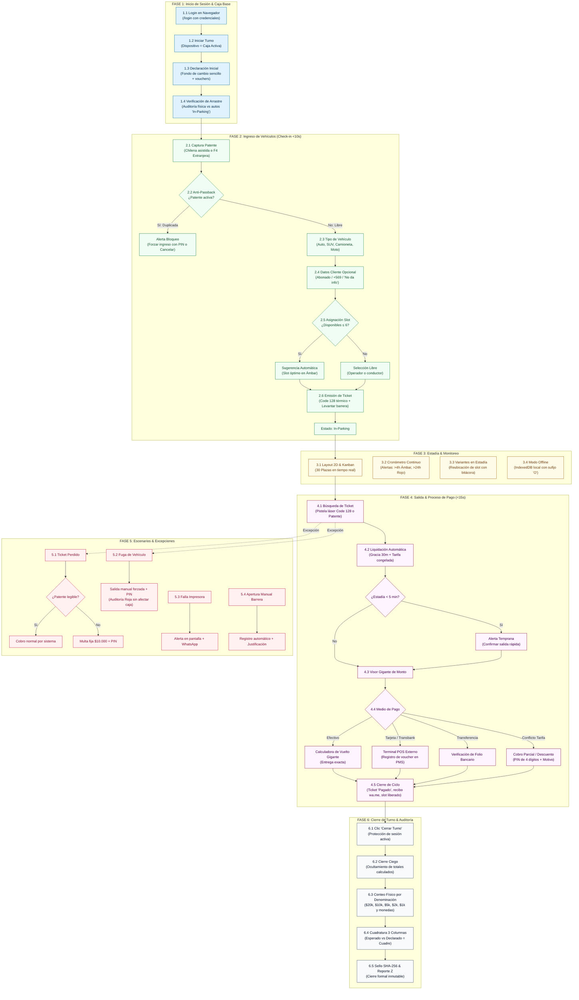

> [!WARNING]
> **DOCUMENTO HISTÓRICO ARCHIVADO — VERSIÓN ANTERIOR**
> Este documento contiene especificaciones previas o parciales generadas en etapas iniciales del proyecto.
> Ha sido preservado exclusivamente para fines de trazabilidad y auditoría histórica.
> 
> **Documentación Vigente Oficial (V2.0 Canónica)**:
> - PRD Maestro: [PRD_SISTEMA_DE_PARKING.md](file:///docs/PRD_SISTEMA_DE_PARKING.md)
> - Especificaciones Técnicas: [PARKOPS_ESPECIFICACIONES_TECNICAS_V2.md](file:///docs/PARKOPS_ESPECIFICACIONES_TECNICAS_V2.md)
> - Diseño, Flujos y Landing: [ESPECIFICACION_DISENO_FLUJO_Y_LANDING.md](file:///docs/ESPECIFICACION_DISENO_FLUJO_Y_LANDING.md)
> - Mapa de Sitio y Navegación: [MAPA_DE_SITIO_Y_ARQUITECTURA.md](file:///docs/MAPA_DE_SITIO_Y_ARQUITECTURA.md)
> - Índice General: [INDICE_DOCUMENTACION.md](file:///docs/INDICE_DOCUMENTACION.md)
> 
> ---

# Procedimiento Operativo Estándar (SOP): Jornada Diaria del Operador de Garita

**Sistema**: ParkOps PMS & ERP — Cordano Inversiones Inmobiliarias Ltda.  
**Instalación**: Serrano 447, Iquique, Chile (~700 m², 30 plazas canónicas)  
**Propósito**: Guía canónica del flujo de trabajo secuencial paso a paso del cajero de garita desde la apertura hasta el arqueo final.

---

## 1. Diagrama de Flujo de la Jornada Operativa (End-to-End)

---

## 2. Matriz de Traducción Funcional: Del Paso Operativo a la Pantalla de Software

| Paso del Operador | Acción Física en Garita | Comportamiento del Software ParkOps | Pantalla / Componente Asignado |
| :--- | :--- | :--- | :--- |
| **1.1 Login** | Abre Chrome y digita usuario/clave | Valida credenciales, comprueba estado de red y prepara el entorno. | `/login` (Selector Perfil + PIN 4 dígitos) |
| **1.2 Iniciar Turno** | Clic en botón "Iniciar Turno" | Registra la terminal como **Caja Activa (Single-Writer)** e inicia el reloj NTP. | Hub de Inicio / Modal de Turno |
| **1.3 Apertura Caja** | Cuenta el sencillo físico en gaveta (\$50.000) | Registra el fondo base y comprobantes heredados como saldo inicial. | `ShiftModal` (Apertura de Turno) |
| **1.4 Arrastre** | Mira los autos en el patio y la pantalla | Muestra lista de autos `In-Parking` de la noche. Permite depurar errores con PIN. | `/operacion/layout` (Tablero Kanban inicial) |
| **2.1 Patente** | Conductor llega; digita patente | Autofoco, formateo automático chileno (AB·CD·12) o switch `F4` extranjera. | `PosCheckin` (Input principal) |
| **2.2 Anti-Passback** | Sistema valida en <100ms | Si la patente está adentro, bloquea con pop-up: "¿Desea forzar ingreso?". | `PosCheckin` (Modal Anti-Passback) |
| **2.3 Tipo Auto** | Selecciona Auto/SUV/Moto | Carga tarifa vigente al ingreso y calcula tiempo de gracia (30m). | `PosCheckin` (Selector de Categoría) |
| **2.4 Datos Cliente** | Pregunta teléfono para ticket digital | Prefijo `+569` fijo; si el cliente dice que no, clic en "No da información". | `PosCheckin` (Campos Opcionales) |
| **2.5 Slot** | Verifica disponibilidad | Si quedan ≤6 espacios libres, sugiere plaza óptima en Ámbar. | `PosCheckin` & `SlotMap` |
| **2.6 Ticket** | Entrega ticket al cliente | Imprime ticket térmico con código de barras Code 128 (sin QR). Levanta barrera. | Impresora 80mm / `window.print()` |
| **3.1 Layout 2D** | Supervisa espacios libres y ocupados | Actualiza en vivo la grilla de 30 plazas con código semántico de colores. | `SlotMap` (Vista 2D Serrano 447) |
| **3.2 Cronómetro** | Detecta autos de larga estadía | Tarjetas Kanban con badges: Ámbar (>4h) y Rojo (>24h alerta de abandono). | `SlotMap` (Vista Kanban) |
| **3.3 Cambio Slot** | Auto se mueve de plaza | Operador arrastra tarjeta al nuevo slot; el sistema audita la reubicación. | `SlotMap` (Drag & Drop con bitácora) |
| **3.4 Sin Internet** | Cae fibra óptica en Iquique | Sistema pasa a modo offline local (IndexedDB) emitiendo tickets con sufijo `O`. | Store PWA Offline-First |
| **4.1 Salida** | Cliente entrega ticket | Pistola láser lee el código de barras o digita patente en buscador rápido. | `PosCheckout` (Input de Búsqueda) |
| **4.2 Cálculo** | Sistema liquida automáticamente | Aplica gracia 30m, redondeo hacia arriba y tarifa congelada al ingreso. | `PosCheckout` (Motor de Cálculo) |
| **4.3 Vuelto** | Cliente paga con \$20.000 en efectivo | Digita \$20.000; la pantalla despliega el **vuelto en números gigantes**. | `PosCheckout` (Calculadora de Vuelto) |
| **4.4 Transbank** | Cliente paga con tarjeta de débito | Digita monto en maquinita Transbank física; confirma en PMS. | `PosCheckout` (Selector Transbank) |
| **4.5 Conflicto** | Cliente reclama demora involuntaria | Operador usa "Cobro Parcial", digita monto acordado, su PIN y motivo. | `PosCheckout` (Modal Cobro Parcial PIN) |
| **4.6 Liberación** | Cobro finalizado | Slot se libera a Verde inmediatamente; ticket pasa a `PAGADO` y `ENTREGADO`. | Store / Layout en Tiempo Real |
| **5.1 Extravío** | Conductor perdió el ticket de papel | Busca por patente; si existe, cobra tiempo real + \$10.000 CLP de multa. | `PosCheckout` (Modal Ticket Extraviado) |
| **5.2 Fuga** | Auto acelera y evade el cobro | Marca salida manual con PIN. Ticket queda anulado en auditoría roja. | `PosCheckout` (Modal Fuga con PIN) |
| **6.1 Cierre** | Termina la jornada laboral | Clic en "Cerrar Turno"; el sistema bloquea nuevas ventas en esa caja. | `ShiftModal` (Protocolo Cierre Ciego) |
| **6.2 Conteo** | Cuenta efectivo en la gaveta | Digita piezas de billetes (\$20k, \$10k, \$5k, etc.) y monedas a ciegas. | `ShiftModal` (Desglose CLP) |
| **6.3 Cuadre** | Envía su declaración física | Sistema revela las 3 columnas: Esperado vs Declarado = Cuadre. Sella SHA-256. | `ShiftModal` (Tabla Cuadratura + Reporte Z) |

---

## 3. Análisis de Valor: Por qué este Esquema es Superior

1. **Eliminación del Estrés Cognitivo**: El cajero nunca tiene que calcular mentalmente fracciones de hora, redondeos a la decena ni vueltos de billetes grandes; el software lo asiste en milisegundos.
2. **Protección Legal y Laboral para el Operador**:
   - Si falta dinero por una fuga o por un cobro parcial autorizado, el operador ingresa su PIN y el sistema lo etiqueta como incidencia justificada, protegiéndolo de descuentos salariales arbitrarios.
3. **Control Ciego Incorruptible para la Propiedad**:
   - El cajero no puede "acomodar" el efectivo antes de cerrar porque el sistema oculta el saldo teórico. La declaración física previa es obligatoria e inmutable.
4. **Resiliencia Total Ante Fallas Externas**:
   - Si falla la impresora: el pago ya está registrado y se envía WhatsApp.
   - Si falla internet: se opera con IndexedDB local y sufijo "O".
   - Si falla Transbank: se conmuta a efectivo o transferencia sin reiniciar el ticket.
