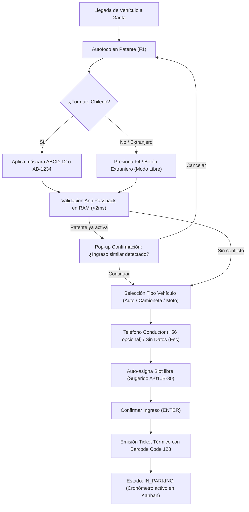
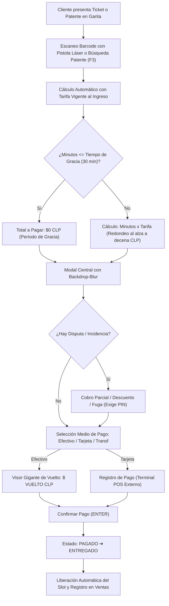
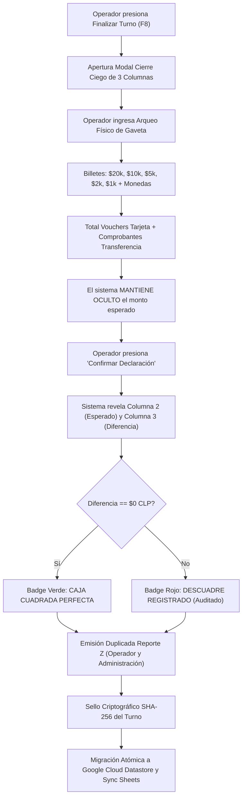

> [!WARNING]
> **DOCUMENTO HISTÓRICO ARCHIVADO — VERSIÓN ANTERIOR**
> Este documento contiene especificaciones previas o parciales generadas en etapas iniciales del proyecto.
> Ha sido preservado exclusivamente para fines de trazabilidad y auditoría histórica.
> 
> **Documentación Vigente Oficial (V2.0 Canónica)**:
> - PRD Maestro: [PRD_SISTEMA_DE_PARKING.md](file:///docs/PRD_SISTEMA_DE_PARKING.md)
> - Especificaciones Técnicas: [PARKOPS_ESPECIFICACIONES_TECNICAS_V2.md](file:///docs/PARKOPS_ESPECIFICACIONES_TECNICAS_V2.md)
> - Diseño, Flujos y Landing: [ESPECIFICACION_DISENO_FLUJO_Y_LANDING.md](file:///docs/ESPECIFICACION_DISENO_FLUJO_Y_LANDING.md)
> - Mapa de Sitio y Navegación: [MAPA_DE_SITIO_Y_ARQUITECTURA.md](file:///docs/MAPA_DE_SITIO_Y_ARQUITECTURA.md)
> - Índice General: [INDICE_DOCUMENTACION.md](file:///docs/INDICE_DOCUMENTACION.md)
> 
> ---


# Documento de Requerimientos de Producto (PRD) Centralizado y Canónico
# ParkOps PMS & ERP — Cordano Inversiones Inmobiliarias Ltda.

**Versión del Documento**: 3.0 Canónica Definitiva  
**Fecha de Emisión**: Septiembre 2026  
**Empresa**: Cordano Inversiones Inmobiliarias Ltda.  
**Ubicación Física**: Serrano 447, Iquique, Chile (Junto al Consulado Italiano)  
**Terreno y Capacidad**: ~700 m² | 30 Plazas Canónicas (Sector A: 01–15, Sector B: 16–30)  
**Microservicio Cloud Run**: `cordano-pms-v1` (GCP: `gen-lang-client-0862587160` | Región: `us-west1` | Puerto: 8080)  
**Proyecto Google Stitch**: `projects/12916038623650348087` (*NUEVO PMS CORDANO - ParkOps Iquique*)

---

## 1. Resumen Ejecutivo y Propósito del Producto

El **Parking Management System (ParkOps)** es una solución integral de software de misión crítica diseñada para digitalizar, optimizar, controlar y auditar las operaciones del estacionamiento de **Cordano Inversiones Inmobiliarias Ltda.** en la ciudad de Iquique, Chile.

El sistema reemplaza por completo las planillas de papel, los registros manuales y las cajas registradoras no auditables por un **Cockpit de Garita de alta velocidad (<100ms de latencia)**, un **punto de venta (POS) resiliente con persistencia local Offline-First**, un **tablero de monitoreo en tiempo real (Kanban y Plano 2D)** y un **módulo financiero con Cierre de Caja Ciego (*Blind Checkout*) y Bitácora de Auditoría Antifraude (*Audit Trail*) inmutable**.

### 1.1 Objetivos de Negocio (Business Goals)
1. **Eliminar fugas de dinero y fraudes operativos**: Registro inmutable de cada peso cobrado, auditando de forma estricta cobros parciales, descuentos, tickets extraviados y salidas de vehículos con PIN individual de operador.
2. **Máxima velocidad de atención en garita (Keyboard-First)**: Procesar el ingreso de un vehículo en menos de 10 segundos y la salida/cobro en menos de 15 segundos, operando 100% sin scroll en monitores de 1080p.
3. **Continuidad operacional absoluta (Offline-First)**: Capacidad de seguir emitiendo tickets físicos y cobrando de forma ininterrumpida ante cortes de energía o caídas del enlace de Internet, sincronizando automáticamente al restablecerse la red.
4. **Transparencia financiera total**: Reconciliación de turnos mediante declaración a ciegas de la gaveta de efectivo (`Declarado - Esperado = Diferencia`), emitiendo actas de arqueo duplicadas (Reporte Z) y sincronizando balances con Google Sheets.

### 1.2 Objetivos de Usuario (User Goals)
- **Operador / Cajero de Garita**:
  - Ingresar matrículas vehiculares chilenas o extranjeras al instante sin tocar el mouse.
  - Imprimir ticket físico en papel térmico con código de barras lineal en menos de 2 segundos.
  - Liquidar estadías con cálculo automático de tarifas y visor gigante de vuelto para cobros en efectivo.
  - Cerrar su turno con total tranquilidad mediante una declaración transparente de su dinero físico.
- **Supervisor / Administrador**:
  - Supervisar en tiempo real la ocupación del recinto y la recaudación desde cualquier equipo o dispositivo móvil (modo visualizador).
  - Auditar de un vistazo las excepciones del día resaltadas en colores (Verde: descuentos autorizados; Rojo: multas, recargos y fugas).
  - Configurar tarifas dinámicas, tiempos de gracia y turnos del personal.
- **Cliente / Conductor**:
  - Proceso transparente, ágil y sin demoras en el acceso y salida.
  - Recibo claro con desglose de minutos transcurridos y tarifas aplicadas.
  - Opción de comprobante físico o digital mediante enlace directo a WhatsApp.

### 1.3 Exclusiones Delimitadas del MVP (Non-Goals)
1. **Sin venta de artículos de retail/tienda**: El sistema gestiona exclusivamente tiempo de estadía vehicular.
2. **Sin sistemas de fidelización por puntos**: Descartado para el lanzamiento inicial.
3. **Sin cuenta corriente o crédito a fin de mes**: Pospuesto para la Fase 2; el cliente frecuente solo existe como ficha histórica informativa.
4. **Sin integración bancaria directa con Transbank API**: El operador utiliza la maquinita POS física externa y selecciona "Tarjeta" en el sistema.
5. **Sin facturación electrónica directa con el SII**: Se emite comprobante de control interno; la boleta fiscal se entrega por máquina registradora externa si el cliente la solicita.
6. **Sin reconocimiento automático de patentes por cámara (LPR) obligatorio**: El operador ingresa la patente manualmente. Las cámaras CCTV son solo enlaces de video streaming IP para visualización.
7. **Sin modo kiosco de autoservicio para clientes**: Operación 100% asistida por personal de garita.

---

## 2. Perfiles de Usuario y Modelo de Permisos

| Rol | Alcance Operativo | Pantallas Accesibles | Permisos Críticos |
| :--- | :--- | :--- | :--- |
| **Operador (Cajero)** | Responsable único de la caja física y emisión de tickets en su turno activo (**Single Writer**). | Cockpit POS (Ingreso/Salida), Plano 2D Serrano 447, Cierre Ciego. | Emisión de tickets, cobro en efectivo/tarjeta, solicitud de excepciones con PIN, cierre de turno. |
| **Supervisor** | Control presencial o remoto de la garita. Solo lectura durante turnos activos ajenos. | Dashboard Operativo, Plano 2D, Bitácora de Auditoría, Visor CCTV. | Modo visualizador en vivo; generación de códigos temporales (OTP) para autorizar excepciones críticas a distancia. |
| **Administrador (Dueño)** | Supervisión general del negocio, configuración de tarifas y auditoría contable. | Portal Corporativo, Módulo de Tarifas, Auditoría Antifraude, Balances ERP. | Configuración de tarifas, creación de usuarios, arqueo de turnos, exportación a Google Sheets. Solo opera caja si abre un turno propio independiente. |

---

## 3. Identificación del Recinto y Topología de Plazas (Serrano 447)

- **Dirección**: Calle Serrano 447, Iquique, Región de Tarapacá, Chile.
- **Superficie**: ~700 m² a nivel de suelo con acceso y salida por calle Serrano.
- **Capacidad Canónica**: **30 Plazas Fijas**:
  - **Sector A (Plazas 01 a 15)**: Costado oeste del terreno.
  - **Sector B (Plazas 16 a 30)**: Costado este del terreno.
- **Gestión de Sobrecupo Temporal**:
  - Los 30 slots se reflejan de forma visual e interactiva en el Plano 2D y el tablero Kanban.
  - Si en días de alta demanda ingresan vehículos adicionales acomodados en el pasillo central, el sistema no bloquea el ingreso: los asigna a slots virtuales de contingencia (`SOBRECUPO-01`, `SOBRECUPO-02`), destacándolos en color de alerta en el Kanban para garantizar que ningún vehículo permanezca sin registro ni cobro.
- **Asignación de Bahía**:
  - **Auto-asignación inteligente no bloqueante**: Al ingresar la patente, el sistema preselecciona automáticamente el primer slot disponible (`A-01` a `B-30`).
  - El operador puede confirmar inmediatamente con `[ENTER]` o cambiar el slot con un clic o arrastre (*drag & drop*).

---

## 4. Flujos Operativos End-to-End

### 4.1 Fase 1: Ingreso de Vehículo (Check-in)


1. **Captura de Patente**:
   - Autofoco permanente en el campo de texto.
   - Si la patente es chilena, se normaliza automáticamente a mayúsculas con máscara (`ABCD-12` o `AB-1234`).
   - Si es extranjera (Perú, Bolivia, diplomática) o especial, el operador presiona `[F4]` o el botón táctil "Patente Extranjera" para ingresar texto libre.
2. **Validación Anti-Passback**:
   - El sistema comprueba en memoria RAM (<2ms) si la patente ya cuenta con una estadía activa.
   - Si existe coincidencia, despliega un modal emergente: *"Existe un ingreso activo registrado recientemente con esta patente. ¿Desea continuar o cancelar?"*, permitiendo sortear errores de digitación sin bloquear la garita.
3. **Categoría Vehicular**:
   - 3 botones táctiles de gran tamaño: **Auto** ($25 CLP/min), **Camioneta/SUV** ($30 CLP/min), **Moto** ($15 CLP/min).
4. **Datos de Contacto (Opcionales)**:
   - Teléfono con prefijo fijo prellenado `+56` y espacio para 9 dígitos (o `+569` con 8 dígitos).
   - Botón `[ESC] Sin Datos`. El sistema audita la proporción de tickets emitidos sin teléfono por operador para evitar omisiones injustificadas.
   - Campo de correo con sugerencia interactiva al escribir `@` (`@gmail.com`, `@hotmail.com`, `@outlook.com`, `@apple.com`).
5. **Generación e Impresión del Ticket**:
   - Generación instantánea del ID canónico: `TKT-AAAAMMDD-T0X-XXXX` (o con sufijo `O` si está offline).
   - Impresión física en impresora térmica (58mm o 80mm) con **código de barras lineal (Code 128)**.
   - El vehículo pasa al estado **`IN_PARKING`** y se activa su cronómetro en el tablero Kanban y plano 2D.

### 4.2 Fase 2: Estadía y Monitoreo en Tiempo Real
- **Cronómetros Tabulares**: Cada vehículo activo computa sus minutos transcurridos en tiempo real mediante tipografía tabular fija (`font-mono tabular-nums`).
- **Tablero Kanban por Tramos de Estadía**:
  1. `< 1 Hora` (Verde Esmeralda)
  2. `1 a 2 Horas` (Azul Pizarra)
  3. `2 a 4 Horas` (Ámbar)
  4. `> 4 Horas` (Rojo Carmesí / Alerta de Sobrestadía)
- **Monitoreo Remoto**:
  - Los dispositivos de supervisión (móviles y portátiles de administradores) se sincronizan cada 30 segundos con el servidor Cloud Run en modo solo lectura.
- **Filtro de Duración Mínima**:
  - Si un ticket se finaliza con **0 segundos**, se descarta por invalidez.
  - Si dura **menos de 5 minutos**, el sistema despliega un pop-up advirtiendo un posible error de digitación y ofrece anular el registro sin cobro.

### 4.3 Fase 3: Salida, Liquidación y Cobro Rápido (POS Check-out)


1. **Búsqueda Inmediata**:
   - Escaneo directo del código de barras Code 128 mediante pistola láser USB (lectura en <100ms) o búsqueda manual por patente (`[F3]`).
   - Si el ticket físico se perdió, el operador busca el vehículo en la lista de entradas activas por patente.
2. **Cálculo de Tarifa**:
   - **Regla de Tarifa Congelada**: Se aplica la tarifa vigente al momento exacto de la entrada del vehículo, protegiendo al cliente si la administración modificó las tarifas durante su estancia.
   - **Tiempo de Gracia**: 30 minutos iniciales configurables sin costo ($0 CLP).
   - **Redondeo**: Minuto cerrado hacia arriba, ajustado a la decena de pesos CLP (`Math.ceil(monto / 10) * 10`).
3. **Liquidación en Pantalla**:
   - Modal flotante central con efecto `backdrop-blur: 20px`.
   - Detalle claro: Patente, Slot, Hora Entrada, Hora Salida, Minutos Totales, Minutos Gracia, Tarifa/min y Total a Pagar.
4. **Cobro en Efectivo y Visor de Vuelto**:
   - Botones rápidos de denominación de billetes chilenos ($20.000, $10.000, $5.000, $2.000, monto exacto).
   - **Visor gigante de vuelto al cliente**: `VUELTO: $ X.XXX CLP` con alto contraste y sugerencia de billetes/monedas.
5. **Comprobante de Pago y Liberación**:
   - Al confirmar el cobro (`[ENTER]`), el ticket pasa a estado **`PAGADO`** y luego a **`ENTREGADO`**, liberando la plaza en el layout 2D.
   - Reimpresión física de comprobante marcada con el sello "PAGADO" si el cliente lo requiere.
   - Enlace directo opcional para enviar el recibo vía WhatsApp (`wa.me`).

### 4.4 Fase 4: Cierre de Turno Ciego (*Blind Checkout*) y Reconciliación


1. **Activación de Cierre**: El operador inicia el cierre desde su garita (`[F8]`).
2. **Declaración Ciega**:
   - El operador cuenta físicamente el dinero de su caja e introduce:
     - Billetes desglosados por denominación ($20.000, $10.000, $5.000, $2.000, $1.000) y monedas.
     - Monto total de vouchers emitidos por el terminal POS de tarjetas.
     - Total de transferencias bancarias verificadas.
   - El sistema **no revela en ningún momento el monto esperado** hasta que el operador envía la declaración.
3. **Revelación y Conciliación**:
   - El sistema despliega la matriz comparativa de 3 columnas:
     - **Columna 1: Declarado Físico**.
     - **Columna 2: Esperado por Sistema** (Caja base inicial + cobros del turno).
     - **Columna 3: Diferencia / Cuadre**.
4. **Emisión de Reporte Z y Cierre de Sesión**:
   - Impresión de acta física duplicada en papel térmico (una copia para el cajero y otra para la administración).
   - Sellado del turno con hash SHA-256 e inicio de la migración atómica a base de datos persistente y Google Sheets.

---

## 5. Especificaciones Técnicas y Arquitectura Backend

### 5.1 Entorno de Ejecución en Google Cloud Platform (GCP)
- **Proyecto GCP**: `gen-lang-client-0862587160` (N° de Proyecto: `349577440002`).
- **Región**: `us-west1` (Oregón).
- **Microservicio Cloud Run**: `cordano-pms-v1` corriendo en puerto `8080`.
- **Contenedor Docker**: Multi-stage Node.js 20 Alpine con compilación `standalone` de Next.js.
- **URL Canónica**: `https://cordano-pms-v1-349577440002.us-west1.run.app`.

### 5.2 Estructura Canónica de Datos e Identificadores

#### 5.2.1 Formato del ID de Ticket
- **Tickets Emitidos Online**:
  $$\text{ID} = \text{TKT-AAAAMMDD-T0X-XXXX}$$
  - Ejemplo: `TKT-20260923-T01-0014` (Fecha: 23-09-2026, Turno: 01, Correlativo: 0014).
- **Tickets Emitidos Offline (Contingencia)**:
  $$\text{ID} = \text{TKT-AAAAMMDD-T0X-XXXXO}$$
  - Ejemplo: `TKT-20260923-T01-0015O`. El sufijo **`O`** garantiza que al reconectar el sistema nunca colisione con tickets emitidos por el servidor.

#### 5.2.2 Ciclo de Vida y Máquina de Estados del Ticket
```
[CREADO] ──(Check-in)──► [IN_PARKING] ──(Liquidación POS)──► [PAGADO] ──(Salida física)──► [ENTREGADO]
                              │                                  │
                              ├─► [ANULADO_POR_ERROR (<5m)]      └─► [EXCEPCIÓN / AUDITADO]
                              └─► [FUGA_SIN_PAGO (PIN)]               ├─► [COBRO_PARCIAL (PIN)]
                                                                      ├─► [DESCUENTO (PIN)]
                                                                      └─► [TICKET_EXTRAVIADO (PIN + $10.000)]
```

#### 5.2.3 Modelo de Persistencia Híbrida: Memoria RAM vs Datastore vs IndexedDB
1. **Capa en Caliente / Memoria RAM (<2ms)**:
   - Conjunto atómico de patentes activas para validación inmediata de Anti-Passback.
   - Matriz de estado de las 30 plazas y cronómetros de permanencia en vivo.
2. **Capa Transaccional / Google Cloud Datastore / Firestore**:
   - Persistencia inmutable de turnos cerrados (`Shifts`).
   - Bitácora de incidencias selladas (`AuditTrail`).
   - Perfiles de clientes recurrentes e historial de patentes (`VehicleProfiles`).
3. **Capa Local Offline-First (IndexedDB en Chrome)**:
   - Almacena en la máquina física de garita todos los tickets generados, pagos recibidos y cierres de turno ante caídas de red.
   - Sincronización transaccional en lote al detectar el evento `navigator.onLine`.

### 5.3 Endpoints API REST (Next.js / Cloud Run)

| Endpoint | Método | Acceso | Propósito Operacional |
| :--- | :--- | :--- | :--- |
| `/api/health` | `GET` | Público | Sondeos de liveness y readiness para balanceador de Cloud Run. |
| `/api/checkin` | `POST` | Operador | Emite ticket canónico, valida anti-passback y asigna plaza. |
| `/api/checkout` | `POST` | Operador | Búsqueda de ticket, cómputo de tarifa congelada, registro de pago y vuelto. |
| `/api/slots` | `GET` / `PUT` | Operador/Admin | Consulta y actualización de ocupación de las 30 plazas en tiempo real. |
| `/api/shifts` | `POST` / `GET` | Operador/Admin | Apertura de turno, Cierre Ciego con arqueo físico e historial de turnos. |
| `/api/audit` | `GET` / `POST` | Admin/Operador | Registro y consulta inmutable de excepciones con verificación de PIN. |
| `/api/cloudrun` | `GET` | Admin | Diagnóstico de salud, latencia y versión del despliegue Cloud Run. |

---

## 6. Sistema de Diseño UX/UI (Estética macOS Minimalista)

### 6.1 Principios de Diseño
- **Ergonomía de Garita (Keyboard-First)**: Toda acción operativa primaria cuenta con atajos de teclado (`F1` a `F9`, `Enter`, `Esc`). Autofoco inmediato en la matrícula.
- **Diseño Sin Scroll en 1080p**: La pantalla principal de operaciones cabe de forma completa en monitores de 1920x1080 píxeles sin barras de desplazamiento vertical ni horizontal.
- **Divulgación Progresiva (Progressive Disclosure)**: Baja densidad visual en el lienzo principal. La información secundaria (detalles de cliente, historial, desgloses técnicos) se abre en **modales centrales flotantes con `backdrop-blur: 20px`**.
- **Tipografía Dual Intencional**:
  - **Geist**: Textos de interfaz, botones, títulos y etiquetas.
  - **Geist Mono / IBM Plex Mono**: Con clase obligatoria `tabular-nums` para patentes chilenas (`KD-JL-84`), moneda en CLP (`$ 3.450`), duraciones y códigos de ticket.

### 6.2 Código Semántico de Colores para Plazas e Incidencias

| Estado | Token de Color | Código Hex | Significado Operativo |
| :--- | :--- | :--- | :--- |
| **Disponible** | `status-available` | `#10B981` / `#30D158` | Plaza vacía lista para asignación inmediata. |
| **Ocupada** | `status-occupied` | `#64748B` / `#1E293B` | Vehículo estacionado dentro del lapso normal. |
| **Reservada / Convenio** | `status-reserved` | `#F59E0B` / `#FF9F0A` | Plaza apartada para empresa asociada (icono candado). |
| **Abonado / VIP** | `status-subscriber` | `#3B82F6` / `#0A84FF` | Cliente con convenio de pago directo. |
| **Movilidad Reducida (PMR)** | `status-pmr` | `#06B6D4` / `#64D2FF` | Plaza adaptada cercana al acceso principal. |
| **Sobrestadía / Alerta** | `status-overstay` | `#EF4444` / `#FF453A` | Vehículo con permanencia superior a 4 horas o en fuga. |
| **Descuento Autorizado** | `audit-discount` | `#10B981` | Incidencia en verde en reportes de auditoría. |
| **Recargo / Multa / Fuga** | `audit-penalty` | `#EF4444` | Incidencia en rojo en reportes de auditoría. |

### 6.3 Catálogo de Pantallas Homologadas en Google Stitch

Las maquetas activas en el proyecto Stitch `12916038623650348087` se estructuran en 4 pantallas madre:
1. **Cockpit Garita y POS Principal** (`d09c4b80583e4978a4cb2630441bd485` y `f7bffe5359044163b9c044c567d61067`):
   - Panel izquierdo: Formulario de ingreso rápido, selector de tipo vehicular y checkbox de impresión.
   - Panel derecho: Matriz viva de vehículos en turno con búsqueda instantánea y botón de cobro `[F2]`.
2. **Plano 2D Serrano 447 y Tablero Kanban** (`83e3e5b92d9645ed920a1a94c21c5e7a` y `64866862dd74475494cadff19437b3d4`):
   - Representación espacial de las 30 plazas canónicas (Sector A: 01–15 y Sector B: 16–30) y conmutador hacia la vista Kanban por antigüedad.
3. **Proceso de Salida y Cobro Rápido** (`16aa7c649bbc45eaab47c4bcb7879ae6`):
   - Modal de liquidación con tarifa congelada, tiempo de gracia aplicado, selector de medio de pago y visor gigante de vuelto.
4. **Cierre de Caja Ciego y Conciliación** (`3b4892334a8744148bc67cbd67e7f9cf` y `1bbb84c9bd264b138da37300edda8b0e`):
   - Arqueo de gaveta física en 3 columnas, cálculo de descuadre y emisión de Reporte Z duplicado.

---

## 7. Integración de Hardware y Periféricos

1. **Impresora Térmica de Rollo (58mm / 80mm)**:
   - Conexión vía USB o red local a la terminal de garita.
   - Acceso nativo desde Chrome mediante drivers de sistema predeterminados.
   - Simbología: **Código de barras lineal Code 128**. Sin códigos QR.
   - Contenido del ticket: Logotipo Cordano, ID de Ticket, Patente, Fecha/Hora, Operador, Tarifa base, Mensaje de tiempo de gracia (30 min) y disclaimer de responsabilidad.
   - Reimpresión libre con contador de copias al pie (`Reimpresión N° X`).
2. **Pistola Lectora de Código de Barras**:
   - Pistola láser estándar USB con emulación de teclado (HID).
   - Al escanear el ticket de salida, gatilla automáticamente la búsqueda del código y abre el modal de cobro sin interacción manual adicional.
3. **Cámaras de Vigilancia CCTV**:
   - Enlaces directos de video IP (streaming RTSP/HLS o enlace web directo al NVR de Serrano 447).
   - Acceso desde la barra superior del sistema para verificación visual humana del portón. Sin procesamiento de IA/LPR en MVP.
4. **Terminal POS de Tarjetas (Transbank)**:
   - Maquinita POS física externa independiente. El cajero procesa la tarjeta en el terminal bancario y registra la confirmación en ParkOps.

---

## 8. Casos Borde y Procedimientos de Contingencia

1. **Ticket Extraviado con Patente Identificable**:
   - El operador busca el vehículo en el sistema mediante la placa patente.
   - Se despliega el cálculo de minutos reales transcurridos desde el ingreso registrado.
   - Se añade la **Multa fija por ticket extraviado ($10.000 CLP)** autorizada mediante el PIN del operador.
2. **Ticket Extraviado sin Patente (Ingreso Irregular)**:
   - Responsabilidad operativa del cajero: el sistema exige ingresar la hora estimada de entrada, calcular el tiempo manualmente y aplicar la multa por extravío con autorización de PIN.
3. **Vehículo en Fuga (Salida sin Pagar)**:
   - El operador selecciona el vehículo activo, ingresa la hora de salida real y presiona "Marcar como Fuga".
   - El sistema exige el ingreso del **PIN individual de 4 dígitos** y la selección obligatoria de una observación.
   - El ticket se anula, el slot se libera y el evento queda registrado en la bitácora de auditoría en color rojo, sin afectar el dinero esperado de caja.
4. **Corte de Red Internet**:
   - El navegador conmuta silenciosamente a la caché local `IndexedDB`.
   - Los tickets emitidos llevan el sufijo `O` (ej. `TKT-20260923-T01-0015O`).
   - Al reanudarse la conectividad, el worker de sincronización transfiere los tickets offline hacia Cloud Run y actualiza la base de datos sin colisiones.
5. **Corte de Energía Eléctrica en Garita**:
   - Al reiniciarse la computadora, Chrome reabre la sesión activa y restaura el estado local desde IndexedDB sin pérdida de tickets activos.
6. **Ajuste de Hora Oficial (Horario de Verano/Invierno Chile)**:
   - Las sincronizaciones horarias se ejecutan contra servidores NTP oficiales de Chile a las 00:00 horas.
   - Si un vehículo permanece estacionado durante el cambio de hora, el cobro se realiza utilizando el cálculo que **beneficie al cliente** (hora menor).

---

## 9. Métricas de Éxito (KPIs Operacionales)

- **Tiempo de Check-in**: Promedio menor a 10 segundos por vehículo.
- **Tiempo de Check-out y Cobro**: Promedio menor a 15 segundos en cobros en efectivo y menor a 10 segundos en tarjeta.
- **Tasa de Conciliación de Caja**: Descuadres inferiores al 0.5% del total recaudado por turno.
- **Disponibilidad de Garita (Uptime POS)**: 99.9% de operatividad local continua mediante IndexedDB.
- **Integridad de Datos**: Cero pérdidas de transacciones ante fallos de conexión o caídas de energía.

---

## 10. Hoja de Ruta de Implementación y Despliegue

```
┌────────────────────────────────────────────────────────────────────────┐
│ PASO 1: Consolidación y Aprobación del PRD Centralizado (Este Doc)    │
└───────────────────────────────────┬────────────────────────────────────┘
                                    │
                                    ▼
┌────────────────────────────────────────────────────────────────────────┐
│ PASO 2: Sincronización del Backend en Google Cloud Run & Datastore     │
│  - Actualización de tipos en types/index.ts (Estados de 4 fases)       │
│  - Adaptación de lib/pmsStore.ts (Sufijo O, Gracia 30m, Fugas con PIN)  │
│  - Validaciones de duración (0s descarte, <5m alerta) y Anti-Passback  │
└───────────────────────────────────┬────────────────────────────────────┘
                                    │
                                    ▼
┌────────────────────────────────────────────────────────────────────────┐
│ PASO 3: Adaptación del Frontend y Sincronización con Google Stitch     │
│  - Homologación de las 4 pantallas madre a 30 plazas canónicas         │
│  - Implementación de atajos de teclado F1-F9 y diseño sin scroll 1080p │
│  - Integración de modales con backdrop-blur y visor gigante de vuelto  │
└───────────────────────────────────┬────────────────────────────────────┘
                                    │
                                    ▼
┌────────────────────────────────────────────────────────────────────────┐
│ PASO 4: Preparación y Despliegue en Google AI Studio & Cloud Run       │
│  - Configuración de contratos limpios para desarrollo asistido por IA  │
│  - Build de producción Docker Alpine y despliegue final en Cloud Run   │
└────────────────────────────────────────────────────────────────────────┘
```

---
*Fin del PRD Centralizado Canónico — ParkOps Cordano V3.0*
