> [!WARNING]
> **DOCUMENTO HISTÓRICO ARCHIVADO — VERSIÓN ANTERIOR**
> Este documento contiene especificaciones previas o parciales generadas en etapas iniciales del proyecto.
> Ha sido preservado exclusivamente para fines de trazabilidad y auditoría histórica.
> 
> **Documentación Vigente Oficial (V2.0 Canónica)**:
> - PRD Maestro: [PRD_SISTEMA_DE_PARKING.md](file:///docs/PRD_SISTEMA_DE_PARKING.md)
> - Especificaciones Técnicas: [PARKOPS_ESPECIFICACIONES_TECNICAS_V2.md](file:///docs/PARKOPS_ESPECIFICACIONES_TECNICAS_V2.md)
> - Diseño, Flujos y Landing: [ESPECIFICACION_DISENO_FLUJO_Y_LANDING.md](file:///docs/ESPECIFICACION_DISENO_FLUJO_Y_LANDING.md)
> - Mapa de Sitio y Navegación: [MAPA_DE_SITIO_Y_ARQUITECTURA.md](file:///docs/MAPA_DE_SITIO_Y_ARQUITECTURA.md)
> - Índice General: [INDICE_DOCUMENTACION.md](file:///docs/INDICE_DOCUMENTACION.md)
> 
> ---


# Reporte Maestro Consolidado & Protocolo de Entrevista Grill-Me: ParkOps Cordano

**Proyecto**: Cordano Operations ERP & ParkOps PMS  
**Empresa**: Cordano Inversiones Inmobiliarias Ltda.  
**Ubicación**: Serrano 447, Iquique, Chile (~700 m², 30 plazas canónicas)  
**Infraestructura**: Google Cloud Run (`gen-lang-client-0862587160`, servicio `cordano-pms-v1`, región `us-west1`)  
**Diseño Oficial**: Identidad Cordano (Logo monocromático oficial + Design System macOS Pathway Redux / Borgoña `#80093A`)  
**Fecha de Publicación**: Septiembre 2026  

---

## 1. Síntesis Ejecutiva de la Documentación (Documentos 1 al 26)

A partir del análisis de los 26 documentos entregados por la dirección (que abarcan desde el *Product Charter*, *ChatPRD V1-V5*, minutas de apertura de Braulio y Angelo, especificaciones del flujo operativo de 6 fases, diccionario de 11 tablas de base de datos, hasta el perfil de usuario del cajero Carlos Morales y la arquitectura Cloud Run), se establece la siguiente matriz de convergencia:

```
┌──────────────────────────────────────────────────────────────────────────────────┐
│                   CONVERGENCIA ESTRATÉGICA PARKOPS CORDANO                       │
├────────────────────────┬─────────────────────────────────────────────────────────┤
│ Propósito Fundamental  │ Blindaje operativo y erradicación de fugas de dinero     │
│ Recinto Físico         │ Serrano 447, Iquique (~700 m²). 30 plazas canónicas.    │
│ Núcleo Transaccional   │ Patente (UID Vehículo) + Teléfono (Canal Comprobante)   │
│ Arquitectura Persistente│ PWA con IndexedDB Local (Sufijo "O") + Google Cloud Run │
│ Ergonomía Garita       │ 100% Sin Scroll en 1080p, Keyboard-First (F1 a F8)      │
│ Filosofía Antifraude   │ Cierre Ciego en 3 Columnas + SHA-256 + PIN Individual   │
└────────────────────────┴─────────────────────────────────────────────────────────┘
```

---

## 2. Fusión de Identidad Visual & Design Tokens "Cordano macOS Pathway"

Se formaliza la unión entre el logotipo oficial de Cordano Inversiones Inmobiliarias Ltda. y la elegancia funcional de Apple Developer:

```
                  ┌───────────────────────────────┐
                  │   LOGO OFICIAL CORDANO        │
                  │   ┌───────────────────────┐   │
                  │   │   ┌───────────────┐   │   │
                  │   │   │       C       │   │   │
                  │   │   └───────────────┘   │   │
                  │   └───────────────────────┘   │
                  └───────────────────────────────┘
```

### Tokens de Diseño Aprobados:
1. **Color de Marca Primario**: **Borgoña Sofisticado** (`#80093A` / Hover: `#A52C55`). Transmite solidez inmobiliaria, elegancia y distinción corporativa en botones de acción principal, indicadores activos de navegación y destacados.
2. **Superficies y Fondos**:
   - Lienzo base: `#F9F9FB` (Gris claro Apple).
   - Contenedores / Tarjetas: `#FFFFFF` con borde sutil `#E2E2E4` (1px solid).
   - Encabezado de garita y dock: `#1A1C1D` (Pizarra carbón de alto contraste).
3. **Semáforo Semántico de Estacionamiento**:
   - **Disponible**: Verde Esmeralda (`#10B981`)
   - **Ocupado**: Gris Pizarra (`#64748B`)
   - **Reservado**: Ámbar (`#F59E0B`)
   - **Abonado / VIP**: Azul Sistema (`#3B82F6`)
   - **PMR (Movilidad Reducida - Ley 20.422)**: Cian (`#06B6D4`) — Plazas A-01 y A-02.
   - **Punto EV Carga Eléctrica**: Violeta (`#8B5CF6`) — Plaza A-03.
   - **Sobrestadía / Alerta Crítica**: Rojo Carmesí (`#EF4444`).
4. **Tipografía**:
   - Textos de interfaz y títulos: **Manrope** (600-700 para títulos, 400 para cuerpo).
   - Valores monetarios en CLP, patentes y cronómetros: **IBM Plex Mono / Geist Mono** con `tabular-nums font-mono` obligatorio.

---

## 3. Catálogo Completo de Pantallas y Módulos a Diseñar

A continuación se detalla el alcance funcional de cada pantalla y módulo que estructurarán la plataforma ParkOps Cordano:

1. **Landing Page Corporativa & Conversión (`/landing`)**:
   - Hero Section con métricas en vivo (Estado de Red Online/Offline, Capacidad 18/30 ocupados).
   - CTA primarios: [ Registrar Entrada ] (Azul/Borgoña) y [ Procesar Salida ] (Verde Éxito).
   - Matriz de dolor y solución (Pérdida por papel vs Blindaje digital).
   - SLAs y garantías de cumplimiento (Check-in <10s, Check-out <15s, Uptime 99.5%).
2. **Sección de Preguntas y Respuestas / FAQ (`/faq`)**:
   - Respuestas operativas para conductores (tarifas por minuto, tiempo de gracia de 30m, extravío de ticket, medios de pago Transbank/efectivo).
   - Guía de contingencia para operadores de garita.
3. **Portal de Autenticación / Login (`/login`)**:
   - Selector visual de perfil: Operador de Garita (Carlos) vs Administrador (Patricia/Braulio/Angelo).
   - Entrada de credenciales y PIN individual de 4 dígitos.
   - Soporte para 2FA / Código temporal OTP.
4. **Recuperación de Contraseña (`/recuperar-password`)**:
   - Flujo seguro mediante correo corporativo y código de un solo uso sin exponer credenciales en pantalla.
5. **Crear Cuenta / Alta de Operadores (`/registro`)**:
   - Acceso restringido únicamente a invitación o creación directa por el Administrador.
   - Asignación de rol, sede (`location_id`), PIN personal y horario de turno.
6. **Hub Central de Inicio (`/inicio`)**:
   - Pantalla de bienvenida que enruta automáticamente al usuario según su rol: al POS transaccional para cajeros, o al Dashboard de supervisión para administradores.
7. **Módulo POS de Ingreso / Check-in (`/operacion/ingreso`)**:
   - Autofoco inmediato en campo de patente (máscara chilena 4x2 y 2x4 + tecla F4 para extranjera).
   - Validación Anti-Passback instantánea (<100ms).
   - Captura opcional de teléfono (+569) y previsualización térmica en PDF con código de barras Code 128 (sin QR).
8. **Módulo POS de Salida & Cobro (`/operacion/salida`)**:
   - Búsqueda por código de barras o patente.
   - Desglose transparente de cobro: minutos totales, tiempo de gracia aplicado, tarifa congelada al ingreso.
   - Calculadora gigante de vuelto para efectivo (`tabular-nums`).
   - Modales de excepción con PIN (Fuga de Vehículo, Ticket Extraviado \$10.000 CLP, Descuento Autorizado).
9. **Módulo Layout Interactivo 30 Plazas (`/operacion/layout`)**:
   - Dual-view: Plano 2D canónico Serrano 447 (Sector A 01-15 con PMR y EV; Sector B 16-30) y Tablero Kanban por antigüedad (<1h, 1-2h, 2-4h, >4h).
   - Pop-up central flotante con efecto `backdrop-blur` para ver ficha del auto y cobrar directo.
10. **Módulo de Turnos & Cierre de Caja Ciego (`/operacion/cierre`)**:
    - Declaración física obligatoria por billetes (\$20k, \$10k, \$5k, \$2k, \$1k) y monedas antes de revelar valores del sistema.
    - Cuadratura en 3 columnas: `Efectivo Sistema` vs `Efectivo Recontado Físico` = `Diferencia / Cuadre`.
    - Sello criptográfico SHA-256 inmutable y generación de Reporte Z térmico 80mm.
11. **Módulo de Auditoría Antifraude (`/auditoria`)**:
    - Bitácora inmutable append-only con filtros por fecha, criticidad, operador y tipo de evento.
    - Registro de valores anteriores y nuevos en formato JSON y marcas en Verde (descuentos) y Rojo (multas/fugas).
12. **Módulo de Reportes & Generador de Archivos PDF (`/reportes`)**:
    - Generación de reportes de turno, resúmenes diarios, semanales y mensuales.
    - Exportador de PDFs térmicos (80mm) y planillas de auditoría en formato CSV/PDF para contabilidad y fiscalización.
13. **Módulo de Configuraciones ERP (`/configuracion`)**:
    - Motor de tarifas dinámicas versionado (precio por minuto, tolerancia de gracia, recargos nocturnos y multas).
    - Configuración de hardware (impresora térmica predeterminada) y enlaces CCTV de cámaras de garita.
14. **Vista de Administrador (Supervisión 24/7)**:
    - Modo estrictamente solo lectura mientras el cajero opera su turno en la garita física.
15. **Vista de Operario Garita (Cajero)**:
    - Modo ergonómico de alta velocidad, 100% sin scroll en resolución 1080p, botones de 48-52px con micro-relieve y atajos de teclado primarios (`F1` a `F8`, `Esc`).
16. **Matriz de Permisos RBAC Granular**:
    - Definición por recurso (POS, Layout, Turnos, Tarifas, Auditoría) y nivel de acceso (Lectura, Operación, Aprobación por PIN, Control Total).

---

## 4. Diagrama de Distribución del Cuestionario Grill-Me (`archify`)

Se ha compilado y verificado formalmente con la skill `archify` el diagrama interactivo de la ruta de decisiones, ubicado en [`docs/diagrams/cuestionario-grillme-flow.html`](file:///c:/Users/BraulioAM/OneDrive%20-%20UNIVERSIDAD%20ANDRES%20BELLO/PROYECTOS%20ANTIGRAVITY/NUEVO%20PMS%20CORDANO/docs/diagrams/cuestionario-grillme-flow.html) y en [`public/cuestionario-grillme-flow.html`](file:///c:/Users/BraulioAM/OneDrive%20-%20UNIVERSIDAD%20ANDRES%20BELLO/PROYECTOS%20ANTIGRAVITY/NUEVO%20PMS%20CORDANO/public/cuestionario-grillme-flow.html).

```mermaid
flowchart LR
    subgraph S1["1. Fundaciones"]
        N1["Etapa 1: Negocio & MVP<br/>Serrano 447 • 30 Plazas"]
        N2["Etapa 2: Identidad Cordano<br/>Borgoña + macOS Pathway"]
    end

    subgraph S2["2. Flujo Operativo"]
        N3["Etapa 3: POS & Check-in<br/>Keyboard-First <10s"]
        N4["Etapa 4: Layout & Kanban<br/>2D Serrano 447 + Alertas"]
    end

    subgraph S3["3. Blindaje & Cloud"]
        N5["Etapa 5: Caja Ciega & PIN<br/>Desglose CLP + SHA-256"]
        N6["Etapa 6: Cloud Run & PWA<br/>Offline-First + AI Studio"]
    end

    N1 -->|Define alcance| N2
    N2 -->|Guía visual| N3
    N3 -->|Asigna slots| N4
    N4 -->|Consolida cobros| N5
    N5 -->|Sella auditoría| N6

    classDef etapa fill:#f9f9fb,stroke:#80093A,stroke-width:2px,color:#1a1c1d;
    class N1,N2,N3,N4,N5,N6 etapa;
```



---

## 5. Cuestionario Maestro de Decisiones Grill-Me

Para iniciar el proceso de validación y definición iterativa con Braulio, presentamos a continuación las preguntas clave ordenadas por etapas. Cada pregunta incluye el contexto de la documentación, la recomendación técnica de la IA y las opciones disponibles para que puedas elegir o proponer una distinta:

---

### ETAPA 1: ALCANCE COMERCIAL Y REGLAS DE NEGOCIO (MVP vs ROADMAP)

#### Pregunta 1.1: Tolerancia y Minutos de Gracia Iniciales
- **Contexto (Docs 3, 7, 11, 14, 21)**: En algunos documentos iniciales se propusieron 10 o 15 minutos, mientras que en la última reunión de Notion y notas operativas se acordó fijar 30 minutos de gracia para incentivar la rotación o salidas breves de cortesía.
- **Opciones**:
  - **A) (Recomendado)**: **30 minutos de gracia fijos por defecto** (configurable por el Administrador en el motor tarifario). Si el cliente se retira dentro de los primeros 30 minutos no paga nada; al minuto 31, ¿se cobra desde el minuto 0 o solo el excedente?
  - **B)**: **15 minutos de gracia**.
  - **C)**: **10 minutos de gracia** (estándar de malls y clínicas en Iquique).
  - **D)**: *Opción personalizada*: ____________________.

#### Pregunta 1.2: Modalidad de Cobro tras Superar el Tiempo de Gracia
- **Contexto (Docs 4, 7, 14)**: Si un vehículo supera la gracia (ej. está 35 minutos y la gracia es 30):
- **Opciones**:
  - **A) (Recomendado)**: **Cobrar la totalidad desde el minuto cero** (los 35 minutos completos redondeados a la decena superior en CLP). Es la práctica habitual en estacionamientos comerciales céntricos para evitar abusos.
  - **B)**: **Cobrar únicamente el tiempo excedente** (solo los 5 minutos que superaron los 30 de gracia).
  - **C)**: *Opción personalizada*: ____________________.

#### Pregunta 1.3: Cuentas Corrientes y Clientes Abonados a Fin de Mes
- **Contexto (Docs 4, 6, 7, 11)**: Se debatió si incluir créditos a fin de mes en el MVP. En el Documento 11 se acordó explícitamente: *"Excluir Cuenta de cliente a fin de mes del MVP; incluir solo como contexto o campo en base de datos"*.
- **Opciones**:
  - **A) (Recomendado)**: **Excluir cuentas corrientes a crédito del MVP**. Operar 100% en pago de contado (Efectivo, Transbank, Transferencia) y dejar solo el campo `tipo_cliente: CONVENIO_MENSUAL` listo en la base de datos para la Fase 2.
  - **B)**: **Incluir en el MVP un selector básico de cliente abonado mensual** con saldo prepago registrado.
  - **C)**: *Opción personalizada*: ____________________.

---

### ETAPA 2: IDENTIDAD VISUAL Y COMPONENTES DE DISEÑO (ESTILO macOS & BORGOÑA)

#### Pregunta 2.1: Implementación del Logotipo Oficial de Cordano
- **Contexto (Documento 10, Design MD y assets)**: El logo adjunto consiste en marcos concéntricos negros redondeados con una 'C' blanca en el centro.
- **Opciones**:
  - **A) (Recomendado)**: **Ubicación dual**: En la barra de navegación superior (44px, modo píldora o cuadrado redondeado elegante) y en la cabecera superior de los tickets térmicos y Reportes Z en blanco y negro puro.
  - **B)**: Solo en la pantalla de Login y Landing Page corporativa, manteniendo el POS con texto minimalista "CORDANO PARKOPS".
  - **C)**: *Opción personalizada*: ____________________.

#### Pregunta 2.2: Balance del Color Borgoña (`#80093A`) con el Semáforo de Plazas
- **Contexto (DESIGN CORDANO vs AGENTS.md)**: El borgoña es el color primario de la marca. Sin embargo, en un estacionamiento el Verde (`#10B981`) y el Rojo (`#EF4444`) tienen significado operacional estricto (Libre vs Ocupado/Alerta).
- **Opciones**:
  - **A) (Recomendado)**: **Borgoña como color de acción de la plataforma (Brand & Shell)**: Botones primarios (Sign In, Iniciar Turno, Configuración, CTA Landing) e indicadores de navegación, mientras que la grilla de slots y estados de ticket mantienen el semáforo funcional estándar (Verde = Libre, Pizarra = Ocupado, Ámbar = Reservado, Cian = PMR, Violeta = EV, Rojo = Sobrestadía/Alerta).
  - **B)**: Utilizar Borgoña en reemplazo del color Rojo para sobreestadías y alertas.
  - **C)**: *Opción personalizada*: ____________________.

---

### ETAPA 3: OPERACIÓN EN GARITA (CHECK-IN, CHECK-OUT & HARDWARE)

#### Pregunta 3.1: Captura de Patentes y Tratamiento de Extranjeras
- **Contexto (Docs 2, 4, 11, 19, 21)**: Por la cercanía de Iquique con Bolivia, Perú y ZOFRI, circulan muchos vehículos con patentes no chilenas.
- **Opciones**:
  - **A) (Recomendado)**: **Autodetección inteligente con tecla de acceso rápido F4**: El input formatea automáticamente patentes chilenas (mayúsculas sin guión). Si el operador detecta una patente extranjera o formato no estándar, presiona `F4` (o clic en el interruptor) para habilitar ingreso alfanumérico libre sin validación de formato chileno.
  - **B)**: Campo de texto completamente libre sin validación previa, dejando la normalización a criterio del cajero.
  - **C)**: *Opción personalizada*: ____________________.

#### Pregunta 3.2: Datos del Conductor y Envío de Ticket Digital por WhatsApp
- **Contexto (Docs 1, 3, 6, 9, 21, 23)**: La captura de teléfono es un dolor si genera demoras en la fila.
- **Opciones**:
  - **A) (Recomendado)**: **Campo opcional con autofoco secundario**: El operador solo pide la patente como campo obligatorio. Si el cliente quiere comprobante digital, digita el número (prefijo `+569` automático). Al confirmar salida o entrada, se provee un botón directo `wa.me` para envío rápido sin bloquear la impresora.
  - **B)**: Exigir obligatoriamente el número de teléfono en cada ingreso.
  - **C)**: Desactivar por completo la opción de WhatsApp en el MVP y operar exclusivamente con ticket térmico de papel.
  - **D)**: *Opción personalizada*: ____________________.

#### Pregunta 3.3: Código de Barras vs Código QR en Ticket Térmico
- **Contexto (Docs 3, 11, 21)**: Se debatió si usar código QR o código de barras tradicional. En las notas operativas se confirmó: *"El PDF térmico debe incluir un código de barras (no QR) para escaneo con pistola de código de barras o teléfono"*.
- **Opciones**:
  - **A) (Recomendado)**: **Código de barras lineal Code 128**: Compatible al 100% con pistolas láser USB de garita estándar, lectura en 0.2 segundos sin encuadre óptico complejo, e inmune al desgaste térmico del papel de 80mm.
  - **B)**: Código QR bidimensional (requiere cámara web o pistola 2D de mayor costo).
  - **C)**: Modo híbrido: Código de barras Code 128 en el ticket físico + Código QR en el comprobante digital de WhatsApp.
  - **D)**: *Opción personalizada*: ____________________.

---

### ETAPA 4: MATRIZ DE 30 PLAZAS EN SERRANO 447 (LAYOUT 2D vs KANBAN)

#### Pregunta 4.1: Distribución Canónica del Recinto Físico
- **Contexto (Docs 9, 11, 15, 21)**: Serrano 447 cuenta con ~700 m² y capacidad establecida de 30 plazas canónicas.
- **Opciones**:
  - **A) (Recomendado)**: **Sector A (01 a 15) al Oeste + Sector B (16 a 30) al Este**:
    - A-01 y A-02: Reservados para Movilidad Reducida (PMR Cian Ley 20.422).
    - A-03: Reservado para Vehículo Eléctrico / Carga (EV Violeta).
    - A-04 a A-15: Estándar Normal.
    - B-16 a B-30: Estándar Normal.
    - Slots virtuales de sobrecupo (`SOBRECUPO-01...`) en caso de saturación temporal de espacio físico.
  - **B)**: Distribución en 3 sectores de 10 slots (Zona A 01-10, Zona B 11-20, Zona C 21-30).
  - **C)**: *Opción personalizada*: ____________________.

#### Pregunta 4.2: Regla de Sugerencia de Plaza con Alta Ocupación
- **Contexto (Docs 1, 3, 6, 19)**: Varios PRDs especifican: *"Cuando queden 6 o menos espacios disponibles (ocupación ≥ 24/30), el sistema sugiere automáticamente un slot específico"*.
- **Opciones**:
  - **A) (Recomendado)**: **Sugerencia activa inteligente cuando queden ≤ 6 espacios**: El sistema resalta en Ámbar la plaza disponible más cercana a la entrada para descongestionar el flujo y evitar que el auto deambule en el recinto.
  - **B)**: Asignación libre en todo momento sin sugerencia del sistema.
  - **C)**: Asignación obligatoria estricta desde el espacio 1 hasta el 30.
  - **D)**: *Opción personalizada*: ____________________.

---

### ETAPA 5: CONTROL DE TURNOS, CAJA CIEGA Y ANTIFRAUDE

#### Pregunta 5.1: Procedimiento de Cierre Ciego de Turno
- **Contexto (Docs 1, 2, 4, 11, 17, 21)**: Es el pilar innegociable de la auditoría.
- **Opciones**:
  - **A) (Recomendado)**: **Desglose interactivo por denominación de billetes y monedas chilenas**:
    - El cajero ingresa conteo físico: billetes de \$20.000, \$10.000, \$5.000, \$2.000, \$1.000 y total de monedas.
    - Ingresa vouchers Transbank y comprobantes de transferencias.
    - Digita su PIN de 4 dígitos.
    - El sistema revela la comparativa en 3 columnas: `Esperado Sistema` vs `Declarado Físico` = `Diferencia / Cuadre`. Si hay descuadre > 5%, exige observación obligatoria y sella el hash SHA-256.
  - **B)**: Declaración en una sola cifra de efectivo global (sin desglose de piezas de billetes).
  - **C)**: *Opción personalizada*: ____________________.

#### Pregunta 5.2: Multa por Ticket Extraviado y Fugas de Vehículos
- **Contexto (Docs 3, 4, 11, 14, 21)**:
- **Opciones**:
  - **A) (Recomendado)**: **Multa fija de \$10.000 CLP parametrizable**: Si el cliente extravía el ticket pero tiene patente, se cobra el tiempo de estadía real + la multa. Si no hay patente registrada, estimación manual con PIN y alerta roja. Si el auto se fuga, anulación inmediata bajo PIN con registro en auditoría roja sin inflar el dinero esperado en caja.
  - **B)**: Cobro de una tarifa plana fija de día completo (\$15.000 CLP) sin calcular horas previas.
  - **C)**: *Opción personalizada*: ____________________.

---

### ETAPA 6: INFRAESTRUCTURA, OFFLINE-FIRST Y ROADMAP DE VISTAS

#### Pregunta 6.1: Filosofía de Persistencia Dual y Colisiones Offline
- **Contexto (Docs 3, 4, 7, 11)**:
- **Opciones**:
  - **A) (Recomendado)**: **Single-Writer Garita + Sufijo "O"**: La terminal de la garita que inició el turno es la única autorizada para escribir. Si internet cae en Iquique, los tickets se emiten localmente en IndexedDB agregando el sufijo `O` (ej: `TKT-20260923-T01-0012O`). Al restablecerse la red, un worker en segundo plano sincroniza con Google Cloud Run vía llaves de idempotencia. Los demás dispositivos (administradores remotos) operan en solo lectura.
  - **B)**: Permitir que múltiples dispositivos abran turno simultáneo en la misma caja (riesgo de colisión de efectivo).
  - **C)**: *Opción personalizada*: ____________________.

#### Pregunta 6.2: Secuencia de Diseño y Creación de Pantallas
- **Contexto**: El usuario solicitó diseñar: Landing page, FAQ, Login, Recuperar contraseña, Registro, Inicio, Módulos operativos, Reportes, PDF, Configuraciones, Vistas Admin/Operario y Permisos.
- **Opciones**:
  - **A) (Recomendado)**: **Avanzar en 3 oleadas visuales**:
    - *Oleada 1*: Experiencia de Acceso y Marca (Landing Page, FAQ, Login, Recuperar Contraseña y Crear Cuenta con identidad Cordano / Borgoña).
    - *Oleada 2*: Núcleo Operativo de Garita (POS Check-in, Check-out con visor gigante, Layout 30 Slots 2D/Kanban y Modal Cierre Ciego).
    - *Oleada 3*: Núcleo Administrativo y Reportes (Dashboard Ejecutivo 24/7, Generador de Reportes PDF/Z, Matriz de Permisos RBAC y Módulo de Tarifas).
  - **B)**: Diseñar todas las pantallas en un solo entregable monolítico.
  - **C)**: *Opción personalizada*: ____________________.

---

## 6. Siguientes Pasos Inmediatos para el Usuario

Este reporte y cuestionario constituyen la plataforma de lanzamiento para afinar el PRD final:
1. Revisa las preguntas de las Etapas 1 a 6.
2. Indica tus elecciones (por ejemplo: `1.1: A`, `1.2: A`, `2.1: A`, o indicando las modificaciones específicas que desees incorporar).
3. Con tus respuestas, consolidaremos el PRD oficial al 100% y comenzaremos la generación de las pantallas y mockups visuales en Next.js y Stitch bajo el estándar Cordano macOS Pathway.
